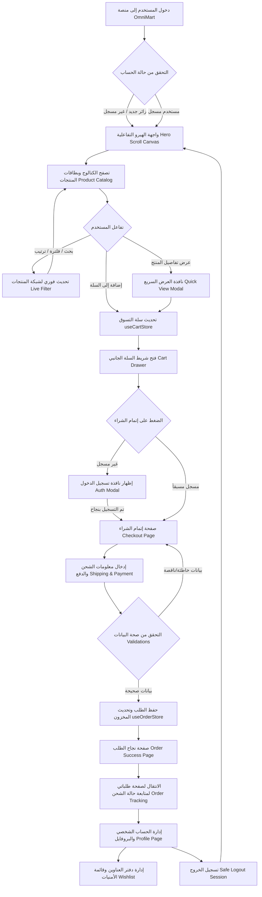

# توثيق الهيكل البرمجي والتقني لمتجر OmniMart
## Project Architecture & Engineering Documentation

> **مستند معماري رسمي وهندسي لتوثيق البناء البرمجي ونظام التشغيل الخاص بمنصة OmniMart للخدمات الرقمية والتسوق التفاعلي.**

---

## 1. حقوق الملكية الفكرية والملكيات (Project Ownership & IP)

* **المصمم والمطور الرئيسي للمنصة (Creator & Lead Architect):**
  **عبد الرحمن إبراهيم ربيع الشافعي** (Abdelrahman Ibrahim Rabie El Shafai) - *Principal Digital Architect & Senior Front-End Engineer*.
* **بيان حماية الملكية الفكرية (IP Protection Statement):**
  جميع الأكواد المصدرية (Source Code)، وهيكلية وتصميم النظام (System Architecture)، والمكونات التفاعلية المخصصة (Custom UI Components)، وتصميم حركة الإطارات عبر الكانفاس (Scroll-Driven Canvas Engine)، وإدارة الحالة البرمجية الموحدة (Zustand State Stores)، وأي تعديلات أو إضافات أجريت على المنصة، هي ملكية فكرية مطلقة وحصرية للمهندس **عبد الرحمن إبراهيم ربيع الشافعي**. يُحظر تماماً نسخ، إعادة إنتاج، توزيع، أو إعادة استخدام أي جزء من هذا المشروع لأغراض تجارية أو غير تجارية دون الحصول على إذن كتابي مسبق وموثق من المالك مباشرة.

---

## 2. الملخص التنفيذي والفئة المستهدفة (Executive Summary & Target Audience)

### الملخص التنفيذي (Executive Summary)
تعتبر منصة **OmniMart** منصة تسوق إلكتروني تفاعلية فائقة السرعة والأداء، تم بناؤها بالاعتماد على أحدث مفاهيم هندسة البرمجيات لتوفير تجربة بصرية وظيفية فريدة. يدمج المشروع بين واجهة المستخدم المتقدمة والمصممة بجماليات عصرية (Visual Rich Aesthetics) ومحرك تفاعلي ثلاثي الأبعاد/إطاري يعتمد على التمرير (Scroll-Driven Canvas UI)، مع ربط فوري لقواعد البيانات والمصادقة وإدارة السلة والمشتريات.

### الفئة المستهدفة وسلوكيات المستخدمين (Target Audience & UX Expectation)
يستهدف متجر OmniMart شريحة واسعة من المستهلكين المهتمين بالتسوق السريع والتكنولوجيا الحديثة:
* **الاهتمام البصري (Eye-Friendly Design & Rich Aesthetics):** يفضل المستخدمون الألوان المنسجمة والتحولات الهادئة بين الوضعين الداكن (Dark Mode) والمضيء (Light Mode)، بالإضافة إلى الخلو الكامل من قفزات التنسيق الفجائية (Zero Layout Shift - CLS=0).
* **الأداء والاستجابة الفائقة (Fluid & Ultra-Fast Response):** تجربة تصفح تفاعلية وفورية للمنتجات والبحث والتصفية الفورية للمنتجات دون إبطاء في التحميل أو الحاجة لإعادة تحميل الصفحة.
* **التوافق التام وثنائية اللغة (RTL/LTR & Mobile-First):** القدرة الكاملة على العمل باللغة العربية (باتجاه اليمين لليسار RTL) أو اللغة الإنجليزية (RTL to LTR) مع ملاءمة شاشات الهواتف الذكية بنسبة 100% وتوفير شريط تنقل سفلي تفاعلي للهواتف الذكية.

---

## 3. هيكلية النظام والتقنيات (System Architecture & Tech Stack)

تعتمد المنصة على بنية تحتية برمجية متقدمة وخفيفة الوزن في ذات الوقت لضمان أفضل توافقية وأسرع وقت استجابة:

```
┌────────────────────────────────────────────────────────────────────────┐
│                              OmniMart Client                           │
│        (React 18+ | TypeScript Strict Mode | Tailwind CSS v4)          │
└───────────────────┬────────────────────────────────┬───────────────────┘
                    │                                │
                    ▼                                ▼
        ┌──────────────────────┐          ┌──────────────────────┐
        │   Zustand Stores     │          │ Interactive Engines  │
        │ (State Management)   │          │ (HTML5 Canvas 60fps) │
        └───────────┬──────────┘          └──────────────────────┘
                    │
                    ▼
        ┌──────────────────────┐
        │  Firebase Services   │
        │  (Auth & Firestore)  │
        └──────────────────────┘
```

### المكونات التقنية الأساسية (Tech Stack Breakdown)
1. **Frontend Core:** استخدام مكتبة **React 18+** مدعومة بلغة **TypeScript** بنمط الصرامة الكامل (Strict Mode) لضمان موثوقية الأكواد وغياب الأخطاء الضمنية (Zero implicit `any`).
2. **Tailwind CSS v4:** محرك التنسيق المطور الذي يستخدم متغيرات CSS وتطبيق سمات التخصيص عبر `@theme` داخل `index.css` لإدارة الألوان والخطوط وحركات الخلفيات الديناميكية.
3. **إدارة الحالة (State Management):** بالاعتماد على **Zustand** عبر متاجر منفصلة وسريعة الاستجابة تقوم بمزامنة البيانات تلقائياً مع التخزين المحلي (`LocalStorage`) لحفظ السلة والطلب والسمات المفضلة واللغة ومصادقة المستخدم.
4. **Interactive Visual Engine:** استخدام عنصر الكانفاس `<canvas>` من HTML5 المدمج داخل بنية React التفاعلية، والذي يعالج إطارات متتابعة بدقة من `/public/frames` ويقوم بتتبع مؤشر التمرير وتحديث العرض بـ 60 إطار في الثانية (60fps Scroll-Driven Scrubbing).
5. **Firebase Service Backend & Storage:**
   - **Firebase Authentication:** لإدارة جلسات المستخدم وتسجيل الدخول والخروج مع الحفظ الآمن لبيانات الحساب.
   - **Cloud Firestore:** مستودع سحابي لحفظ الطلبات، وعناوين الشحن، وحالة المعاملات وتحديث مسار التتبع في الوقت الفعلي.
   - **LocalStorage:** لمزامنة بيانات سلة التسوق، وحالة الثيم النشط محلياً دون التسبب في تأخير للشبكة.

---

### هيكل مجلدات المشروع (Folder Structure Tree)

```
E-commerce website/
├── index.html                # الملف الرئيسي لواجهة الويب والربط بأيقونة الموقع /icon.png
├── vite.config.ts            # إعدادات المترجم الفائق وسير العمل لـ Vite
├── tsconfig.json             # تهيئة إعدادات لغة TypeScript وتصنيف الصرامة
├── public/                   # المجلد العام للملفات الثابتة والمشتركة
│   ├── icon.png              # الأيقونة الرسمية والمولدة لمتجر OmniMart
│   └── frames/               # مجلد إطارات الكانفاس التفاعلية (1.png إلى 41.png)
└── src/                      # المجلد البرمجي الرئيسي للتطبيق
    ├── App.tsx               # نقطة الدخول والمحور الرئيسي للتطبيق وإدارة التبويبات النشطة
    ├── index.css             # التنسيقات العامة وقاموس سمات الألوان والـ Keyframes المخصصة لـ Tailwind v4
    ├── main.tsx              # نقطة بدء تشغيل تطبيق React وتثبيته في شجرة DOM
    ├── components/           # المكونات التفاعلية القابلة لإعادة الاستخدام
    │   ├── auth/             # واجهة مصادقة المستخدم وتصميم نافذة تسجيل الدخول المنبثقة
    │   ├── cart/             # شريط السلة، عناصر المنتجات، شريط حساب الشحن المجاني الترويجي
    │   ├── common/           # بطاقة المنتج ومكونات العرض البصرية المشتركة
    │   ├── hero/             # محرك الكانفاس وهيرو التمرير (HeroScrollSection.tsx)
    │   ├── layout/           # الهيكل المحيط بالمنصة (التذييل، الهيدر الزجاجي Megamenu، شريط الجوال السفلي)
    │   ├── products/         # مصنفات المنتجات، الفرز، شريط البحث، والشبكة المرئية
    │   ├── profile/          # السايدبار للبروفايل، إدارة العناوين، تتبع مسارات الطلب
    │   └── ui/               # عناصر الواجهات البسيطة (أزرار مخصصة، صناديق الحوار، درور، سيلكت، سكيلتون)
    ├── hooks/                # الخطافات المخصصة للتطبيق
    │   └── useDocumentTitle.ts # خطاف المزامنة التفاعلية لعنوان الصفحة مع المتجر
    ├── pages/                # الصفحات والشاشات الأساسية للمتجر (سواء متجر، سلة، بروفايل، الخ)
    ├── store/                # متاجر Zustand لإدارة تدفق البيانات وتحديثاتها
    ├── types/                # تعريفات الأنواع وتنسيقات البيانات الخاصة بـ TypeScript
    └── utils/                # البيانات الوهمية للمنتجات ووظائف المساعدة العامة
```

---

## 4. مخطط رحلة المستخدم الكلية (End-to-End User Journey Diagram)

يوضح المخطط التالي دورة تصفح وتفاعل المستخدم في متجر OmniMart، منذ الدخول وحتى إتمام الشراء وإدارة الحساب:



---

## 5. المنطق البرمجي والخصائص الوظيفية (Core Business Logic)

### أ. التوجيه وتعديل التبويبات النشطة (Dynamic Navigation & Routing)
يستخدم التطبيق نظام توجيه يعتمد على الحالة المخزنة في Zustand عبر المتجر [`useNavigationStore.ts`](file:///d:/MyWebsite/E-commerce%20website/src/store/useNavigationStore.ts) بدلاً من موجهات الويب التقليدية لتسريع زمن الانتقال.
* يدعم حالات التبويب الأساسية: `shop` | `cart` | `checkout` | `order-success` | `orders` | `profile`.
* يتولى تغيير العنوان تلقائياً وتفعيل التنقل بين الأقسام الفرعية لصفحة الملف الشخصي.

### ب. محرك الهيرو الكانفاسي بالتمرير (Canvas Interactive Hero)
يعتمد الملف [`HeroScrollSection.tsx`](file:///d:/MyWebsite/E-commerce%20website/src/components/hero/HeroScrollSection.tsx) على المعالجة التالية:
* **مرحلة التحميل المسبق (Preloader):** يتم إنشاء كائنات `Image` تفاعلية وتتبع تحميل الإطارات من `1.png` إلى `41.png` وحساب النسبة المئوية التقدمية.
* **معادلة التمرير والـ Scrubbing:**
  $$\text{Progress} = \frac{-\text{BoundingClientRect.top}}{\text{ScrollHeight} - \text{InnerHeight}}$$
  يتم رسم الإطار المتناسب مع النسبة بدقة متناهية:
  $$\text{FrameIndex} = \lfloor\text{Progress} \times (\text{TOTAL\_FRAMES} - 1)\rfloor$$
* **الحساب البعدي والتغطية (Canvas Cover Fit):** عند التمرير أو تعديل مقاس النافذة، تحسب أبعاد الصورة والكانفاس لمنع التشوه البصري والمحافظة على النسبة الأصلية للصورة (Aspect Ratio).
* **التراجع الذكي (Graceful Fallback Trigger):** في حال حدوث أي خطأ في تحميل الصور أو فقدانها، ينتقل الكود تلقائياً وبشكل صامت وبدون التأثير على تجربة التصفح إلى الخلفية الملونة والمتحركة بتموج هادئ عبر لغة CSS.

### ج. محرك المنتجات والكتالوج (Product Catalog Engine)
تتم معالجة تصفية وترتيب البيانات بشكل فوري ولحظي عبر المتجر المخصص للفلاتر [`useFilterStore.ts`](file:///d:/MyWebsite/E-commerce%20website/src/store/useFilterStore.ts):
* **التصفية المتعددة:** تصفية بحسب الفئات المحددة، نطاق الأسعار، التقييم، وتوافر المنتج في المخزون.
* **البحث الفوري المتزامن (Real-time Search):** يبحث عن الحروف المدخلة في العناوين الإنجليزية والعربية والماركة ورقم التعريف (SKU).
* **إدارة الترقيم الصفحي (Pagination):** يعاد تعيين الصفحة النشطة إلى `1` تلقائياً فور تغيير خيارات التصفية أو الفرز لمنع عرض صفحات فارغة.

### د. نظام عربة التسوق وإتمام الشراء (Cart & Order Management)
يتحكم المتجر [`useCartStore.ts`](file:///d:/MyWebsite/E-commerce%20website/src/store/useCartStore.ts) بجميع تعديلات العربة:
* **حساب القيم المجمعة:** حساب التكلفة الكلية وضريبة المشتريات ومؤشر الشحن المجاني الترويجي بشكل فوري.
* **الربط بالملف الشخصي:** تعبئة بيانات الشحن والعنوان تلقائياً في صفحة الدفع مستلهمةً من دفتر العناوين المحفوظ للمستخدم لتسهيل عملية الشراء وتقليص نسبة التخلي عن العربة (Cart Abandonment).

### هـ. إدارة الملف الشخصي (User Profile Management)
تحتوي صفحة البروفايل على منطق كامل يتيح إدارة العناوين (إضافة، تعديل، حذف)، ومراجعة تفصيلية للطلبات السابقة ومتابعة مسار التوصيل الفعلي عبر محاكاة خط زمني (Timeline View) تفاعلي لحالات الطلب (`pending` -> `processing` -> `shipped` -> `delivered`).

---

## 6. بنية الأمان والطبقات الدفاعية (Security Architecture)

لحماية بيانات المستخدمين وضمان سلامة التدفق المالي والمعلوماتي للمنصة، تم تطبيق أربع طبقات أمان صارمة:

1. **أمان المصادقة (Authentication Security):**
   * يتم ربط حسابات المستخدمين بنظام **Firebase JWT (JSON Web Tokens)** للتحقق الفوري والمشفر من هوية المستخدم.
   * يتم تطبيق إجراءات تنظيف ومسح كاملة للذاكرة المؤقتة والحالة المحلية لبيانات السلة والملف الشخصي فور تفعيل زر تسجيل الخروج لضمان عدم مشاركة الجلسات.

2. **سلامة وهيكلة البيانات (Strict Typing & Payload Sanitization):**
   * استخدام هياكل TypeScript صارمة للغاية لتحديد شكل ومكونات المدخلات البرمجية (`Product`، `User`، `Order`، `Address`).
   * منع تمرير الحقول غير المعروفة أو المحقونة برمجياً (Payload Injection) عبر فحص الحقول في واجهات الإدخال قبل الإرسال.

3. **قواعد حماية Firestore (Firestore Rules & Authorization):**
   * تطبيق سياسة إذن القراءة والكتابة فقط للمالك للوثيقة. لا يمكن للمستخدم استعلام طلبات مستخدمين آخرين حتى لو كان يمتلك رقم معرف الطلب.
   * التحقق من تطابق حقل `userId` مع معرف التوثيق الفعلي (`auth.uid`) في قواعد السحابة.

4. **الواجهات الدفاعية والوقاية من الانهيار (Defensive UI & WSOD Prevention):**
   * حماية التطبيق من شاشات الموت البيضاء (White Screen of Death) عبر عزل معالجة البيانات غير المتوقعة وعرض مكونات بديلة ومستقرة للمستخدم.
   * معالجة الاستدعاءات الفاشلة للشبكة (Network Failures) والـ API بلطف وعرض رسائل تنبيه واضحة ومترجمة.

---

## 7. طبقات الجودة واختبارات النظام (Quality Assurance & Performance)

يخضع نظام OmniMart لمعايير الجودة الصارمة لضمان بقائه في أعلى درجات الكفاءة البرمجية:

### أ. فحص أنواع الأكواد الساكنة (Static Type Safety)
يتم إجراء الفحص البرمجي الكامل للأخطاء والتحذيرات باستخدام أمر مترجم TypeScript:
```bash
tsc -b --noEmit
```
يضمن هذا الفحص عدم احتواء كود النظام على أي تعريفات غامضة أو غير صالحة للتشغيل.

### ب. مؤشرات أداء الويب الحيوية (Performance Core Web Vitals)
* **ثبات الهيكل البصري (CLS = 0):** حجز أبعاد الكانفاس بوضعية ملء الشاشة المطلقة وإظهار هياكل التحميل المؤقتة (Skeletons) يمنع حدوث أي قفزة أو حركة غير مرغوبة للكتالوج أثناء تنزيل المحتويات.
* **التحميل الفوري التفاعلي (FCP & LCP):** لا تنتظر الواجهة تحميل إطارات الكانفاس لتظهر؛ إذ تظهر المحتويات وعناوين الهيرو وأزرار التفاعل فوراً على الخلفية المتحركة بينما يتم استكمال جلب الإطارات خلف الكواليس.

### ج. التوافقية والتجاوب مع أحجام الشاشات (Cross-Device Profiling)
تم اختبار المتجر عبر ثلاث حواف تجاوب رئيسية لـ Tailwind CSS:
* **الهواتف الذكية (أصغر من 768px):** إخفاء القوائم الجانبية، تفعيل الدرور المتنقل للفلاتر، وتوفير شريط سفلي تفاعلي لتسهيل الوصول بالإبهام.
* **الأجهزة اللوحية (768px - 1024px):** تنسيق شبكي مرن لبطاقات المنتجات مع إخفاء ذكي لبعض التفاصيل غير الجوهرية.
* **شاشات العرض المكتبية (أكبر من 1024px):** واجهة ممتدة بالكامل، قائمة فئات منسدلة عملاقة (Megamenu)، وجوانب فلاتر مدمجة ومثبتة جانبياً للتصفح السريع.

---

## 8. إرشادات الصيانة والتشغيل والترقية (Maintenance & Guidelines)

### إرشادات تشغيل وبناء النظام
لبناء المشروع وتجهيز النسخة الإنتاجية المستقرة والمضغوطة:

1. تنزيل الحزم التبعية للمشروع:
   ```bash
   npm install
   ```
2. تشغيل بيئة التطوير المحلية للمطورين:
   ```bash
   npm run dev
   ```
3. بناء نسخة الإنتاج النهائية في مجلد `/dist`:
   ```bash
   npm run build
   ```

### إرشادات الصيانة الدورية وإضافة المميزات
* **تعديل وتوسيع المنتجات (`mockData.ts`):** عند إدراج فئات أو منتجات جديدة في [`mockData.ts`](file:///d:/MyWebsite/E-commerce%20website/src/utils/mockData.ts)، يجب تزويد الكائنات برقم SKU فريد ومعرف فئة `categoryId` صحيح متطابق مع جدول الفئات لضمان عمل الفلترة الفورية بشكل صحيح.
* **تغيير إطارات الكانفاس التفاعلي:** يمكن ترقية عدد الإطارات أو تغيير لاحقتها بسهولة متناهية عبر تعديل الثوابت المخصصة في أعلى ملف [`HeroScrollSection.tsx`](file:///d:/MyWebsite/E-commerce%20website/src/components/hero/HeroScrollSection.tsx):
  ```typescript
  const TOTAL_FRAMES = 41; // غير الرقم إلى عدد الإطارات الجديد المتوفر
  const FRAME_EXTENSION = 'png'; // قم بتعديل الامتداد في حال استخدام jpg أو webp
  ```

---

> **تم إعداد هذا المستند الهندسي والمعماري من قبل المهندس والمهندس المعماري الرقمي الأول عبد الرحمن إبراهيم ربيع الشافعي لتوثيق وإدارة أصول وهيكلية متجر OmniMart.**
